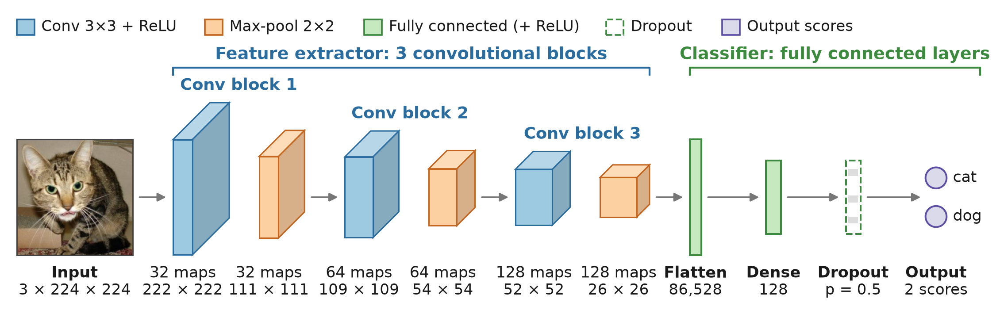

# IE4483 Mini Project 2: Dogs vs Cats Classification

A convolutional neural network (CNN) built and trained from scratch in PyTorch to classify images as cats or dogs, for the IE4483 Artificial Intelligence and Data Mining mini project (Option 2). The same CNN is then adapted to CIFAR-10 (part g) and to an imbalanced version of CIFAR-10 (part h).

The whole project is in one notebook, `cnn.ipynb`: data exploration, preprocessing, the model, training, evaluation, test predictions and the CIFAR-10 experiments.

## Results

| Experiment | Evaluated on | Accuracy |
|---|---|---|
| Dogs vs Cats, main model (with augmentation) | 3,000 validation images | **90.03%** |
| Dogs vs Cats, no augmentation (part f) | 3,000 validation images | 79.23% |
| CIFAR-10 (part g) | 10,000 test images | **85.04%** |
| Imbalanced CIFAR-10, no fix (part h) | 10,000 test images | 72.33% |
| Imbalanced CIFAR-10, class-weighted loss (part h) | 10,000 test images | 76.63% |
| Imbalanced CIFAR-10, oversampling (part h) | 10,000 test images | 76.96% |

The Dogs vs Cats test labels are not provided, so that task is scored on the validation set. In part (h), the average recall of the three minority classes rises from 28.67% with no fix to 59.30% with class-weighted loss and 56.80% with oversampling.

## Project structure

```
├── cnn.ipynb               # the whole project; run from top to bottom
├── requirements.txt        # Python packages
├── .venv/                  # Python environment you create yourself (not in the repository)
├── sampleSubmission.csv    # submission template; the notebook reads its 500 test ids
├── submission.csv          # our test predictions (id,label; 1 = dog, 0 = cat)
├── datasets/datasets/      # Dogs vs Cats images (not in the repository, see "Data")
├── cifar-10-python/        # CIFAR-10 python version (not in the repository, see "Data")
└── outputs/
    ├── models/             # best weights (<run>_best.pt) and per-epoch history (<run>_history.csv)
    └── figures/            # figures for the report
```

## What you need

The repository holds the code and results only. Three things are not uploaded, so add them before running the notebook:

| Not in the repository | Reason | How to add it |
|---|---|---|
| Python environment (`.venv/`) | Specific to each computer, and too large to upload | Create it from `requirements.txt` (see [Setting up the environment](#setting-up-the-environment)) |
| Dogs vs Cats images (`datasets/datasets/`) | About 1.2 GB | Download `datasets.zip` from Google Drive (see [Data](#data)) |
| CIFAR-10 (`cifar-10-python/`) | About 180 MB | Download it (see [Data](#data)) |

You also need:

- **Python 3.14**, the version we used
- **VS Code with the Jupyter extension**, or Jupyter Notebook
- **An NVIDIA GPU with an up-to-date driver** (recommended). The notebook also runs on the CPU, but training is much slower.

We developed the project on Windows 11 with an NVIDIA RTX 5050 Laptop GPU (8 GB).

## Setting up the environment

Run these commands in a terminal opened in the project folder:

```powershell
python -m venv .venv

# PyTorch first, from the CUDA 12.8 index (RTX 50-series GPUs need CUDA 12.8 or newer)
.venv\Scripts\python -m pip install torch torchvision --index-url https://download.pytorch.org/whl/cu128

# Everything else
.venv\Scripts\python -m pip install -r requirements.txt
```

On macOS or Linux, use `.venv/bin/python` instead of `.venv\Scripts\python`. Without an NVIDIA GPU, install the standard PyTorch build instead: `.venv\Scripts\python -m pip install torch torchvision`.

`requirements.txt` installs these packages. The versions shown are the ones we used:

| Package | Version | Used for |
|---|---|---|
| torch | 2.11.0 (CUDA 12.8 build) | building and training the CNNs |
| torchvision | 0.26.0 | image folders, transforms and the CIFAR-10 loader |
| numpy | 2.5.3 | arrays and random sampling |
| pandas | 3.0.6 | tables and CSV files |
| matplotlib | 3.11.2 | plots and figures |
| seaborn | 0.13.2 | plot style and the CIFAR-10 bar chart |
| pillow | 12.3.0 | opening images |
| scikit-learn | 1.9.1 | classification reports, confusion matrices, recall and F1 |
| tqdm | 4.70.1 | progress bars during data exploration |
| imagehash | 4.3.2 | imported in the first cell |
| ipykernel, jupyter | 7.3.0, 1.1.1 | running the notebook |

## Data

The datasets are not in the repository because of their size (about 1.2 GB and 180 MB).

**Dogs vs Cats.** Download `datasets.zip` from [Google Drive](https://drive.google.com/file/d/1q0r6yeHQMS17R3wz-s2FIbMR5DAGZK5v/view) and extract it into the project folder as a folder called `datasets`. Windows "Extract All" names the folder after the zip, which gives this layout:

```
datasets/datasets/
├── train/cat/   10,000 images
├── train/dog/   10,000 images
├── val/cat/      2,500 images
├── val/dog/      2,500 images
└── test/           500 unlabelled images (1.jpg to 500.jpg)
```

If your unzip tool puts the folders straight into `datasets/` (for example `datasets/train/`), either move them into `datasets/datasets/` or change `DATA` in the notebook's first code cell to `ROOT / "datasets"`.

**CIFAR-10.** Download the "CIFAR-10 python version" from <https://www.cs.toronto.edu/~kriz/cifar.html> and extract it into `cifar-10-python/`, so that `cifar-10-python/cifar-10-batches-py/` contains `data_batch_1` to `data_batch_5` and `test_batch`. Alternatively, set `download=True` in the first Part G cell and torchvision will download it.

## Running the notebook

1. Open `cnn.ipynb` in VS Code or Jupyter and select the `.venv` kernel.
2. Restart the kernel and run the cells in order from the top. Later cells depend on variables set earlier, so running cells out of order can mix old and new settings.

| Notebook section | What it does | Saved outputs |
|---|---|---|
| Exploratory Data Analysis | Image counts, sizes, aspect ratios and colour modes | – |
| Data Preprocessing | Transforms, seeded balanced subsets (5,000 training and 1,500 validation images per class), loaders, a train/val pixel-range check | – |
| Building the CNN Model | `CustomCNN` and a shape check | – |
| Training the model, Training + Validation | Trains with early stopping and saves the best weights | `baseline_3conv_best.pt`, `baseline_3conv_history.csv` |
| Classification report | Validation report and confusion matrix | `baseline_3conv_confusion_matrix.png` |
| Apply model on Test Dataset | Predicts the 500 test images, in the template's id order | `submission.csv` |
| Part F | Retrains the same model without augmentation and compares the two runs | `baseline_3conv_noaug_*`, `augmentation_comparison.png` |
| Part G | CIFAR-10: 45,000/5,000 train/validation split, `CifarCNN`, 100-epoch run, one final test evaluation | `cifar_cnn_100ep_*`, `cifar_class_counts.png` |
| Part H | Imbalanced CIFAR-10 (bird, cat and truck cut to 10%): no fix, class-weighted loss, oversampling | `cifar_imb_*`, `cifar_imbalanced_counts.png`, `cifar_imbalance_recall.png` |

Running every cell retrains all six models and overwrites their saved files. The evaluation cells always load the best weights from `outputs/models/<run>_best.pt`, not the model left in memory.

## Model and training



`CustomCNN` takes a 3 × 224 × 224 image and outputs two raw scores (cat, dog):

- three blocks of Conv 3×3 (32, 64 and 128 filters, no padding) → ReLU → MaxPool 2×2, giving 128 × 26 × 26 feature maps
- Flatten (86,528 values) → Dense 128 → ReLU → Dropout 0.5 → Dense 2
- Kaiming (He) initialisation for the ReLU layers; about 11.2 million parameters

| Setting | Dogs vs Cats |
|---|---|
| Data | 10,000 training / 3,000 validation images (seeded, balanced subsets) |
| Training augmentation | rotation up to ±15°, random resized crop to 224 × 224 (60–100% of the area), horizontal flip, colour jitter (brightness, contrast, saturation 0.3) |
| Validation/test transform | resize the shorter side to 256, centre crop 224 × 224 |
| Pixel scaling | 0–1 only (no mean/std normalisation) |
| Loss | cross-entropy |
| Optimiser | Adam, learning rate 0.001, weight decay 0.0001 |
| Learning-rate schedule | ReduceLROnPlateau on validation loss (factor 0.5, patience 2) |
| Batch size, epochs | 32, up to 50 |
| Early stopping | stops after 10 epochs without a better validation accuracy; the best weights are kept |
| Seed | 42 |

`CifarCNN` (parts g and h) uses the same layers with padding 1, so a 32 × 32 input becomes 128 × 4 × 4 before the dense layers, and it has 10 outputs. It is trained with the same optimiser for up to 100 epochs, with random crops (padding 4) and horizontal flips, and 500 training images per class are held out for validation.

## Outputs

- `outputs/models/`: `<run>_best.pt` (best weights) and `<run>_history.csv` (loss, accuracy and learning rate for every epoch). The `cifar_cnn_*` files come from an earlier 50-epoch CIFAR-10 run; the reported result is `cifar_cnn_100ep`.
- `outputs/figures/`: confusion matrices, learning curves and charts saved by the notebook, plus `cnn_architecture.png`, which was drawn separately.

## Reproducibility

- Every run uses seed 42 with deterministic cuDNN, and a freshly seeded training loader is created just before each run, so re-running a section on the same machine gives the same result.
- On Windows, DataLoader worker processes cannot use a `Dataset` class defined inside the notebook, so the test-image loader uses `num_workers=0`.
- Results may differ slightly on other GPUs or library versions.
